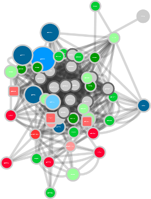
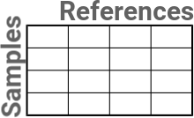
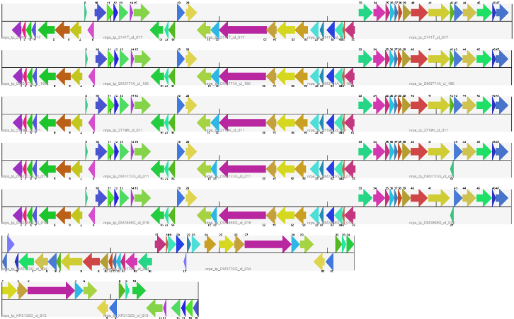
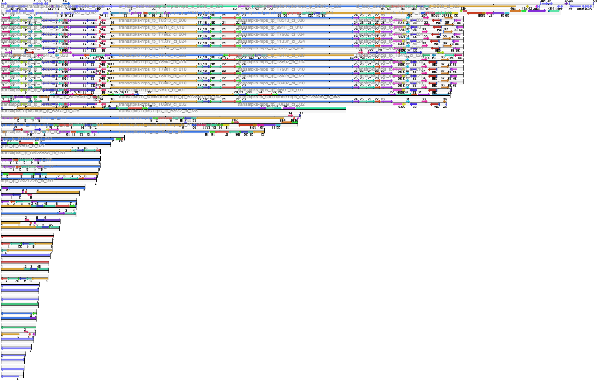
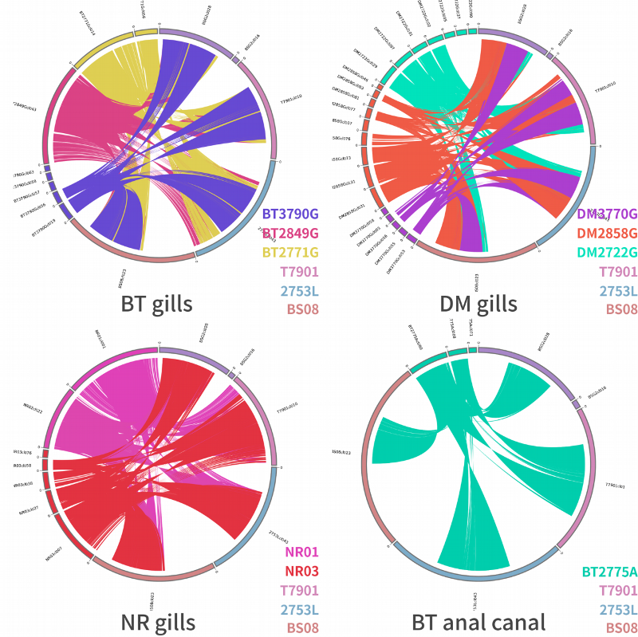

# Why I used a circos to visualize my results

## My data
I generated data that compared DNA sequences from different samples with their counterparts in chosen references.  I produced a network to show an overview of the relationships.  But I wanted inspect one particular subcluster.  

## From table...
In particular, I wanted to to know how similar or different my samples were to the references.  I gathered my data in a table that looked like this:

  

where each column is actually split into more columns, with fields that may or may not be filled.

## ...to stacked alignment... 
But I'm just a flawed human being and not a machine, and this table gave me no insight whatsoever. So I decided to present my comparison in the form of a stacked alignment.  My expectation was something like this:  

  

But there were too many elements in my subnetwork, that what I got was a this headache:  

  

where, as you can see, you cannot see anything.  The top and the bottom are far from each other and difficult to compare.  Also, I have to choose only one reference top put to the top.

But with larger alignments, it was of no help at all.

## ...to a circular alignment

So I chose to present my data via circos.  This way, all sequences are of equal distance to each other, and I don't have to choose just one reference. 

 This work is licensed under a <a rel="license" href="http://creativecommons.org/licenses/by-nc-nd/4.0/">Creative Commons Attribution-NonCommercial-NoDerivatives 4.0 International License</a>.

Circos was created by Martin Krzywinski, and you can read more about it at http://circos.ca/.
